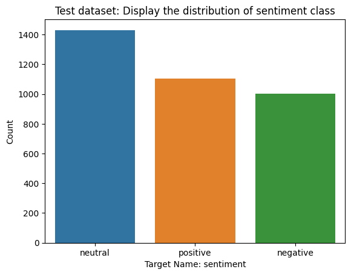

### Tweet Sentiment Extraction

https://www.kaggle.com/c/tweet-sentiment-extraction/overview

### Install dependencies

In order to install the required dependencies, you have to run the following command at root level.

```
pip install -r requirements.txt
```

### Run flask

Go to api folder

```
set FLASK_APP=api.py

flask run
```

http://127.0.0.1:5000/

Or run the runFlask.cmd on buildingScripts

### Run Angular Project

frontEnd

```
ng serve
```

http://localhost:4200/

Or run the runAngular.cmd on buildingScripts

### Distribution of Sentiment class



| Target| Rows
| ---- |:-----:
| Negative | 7781  |
| Neutral  | 11118 |
| Positive | 8582  |

We consider this dataset as imbalanced???
